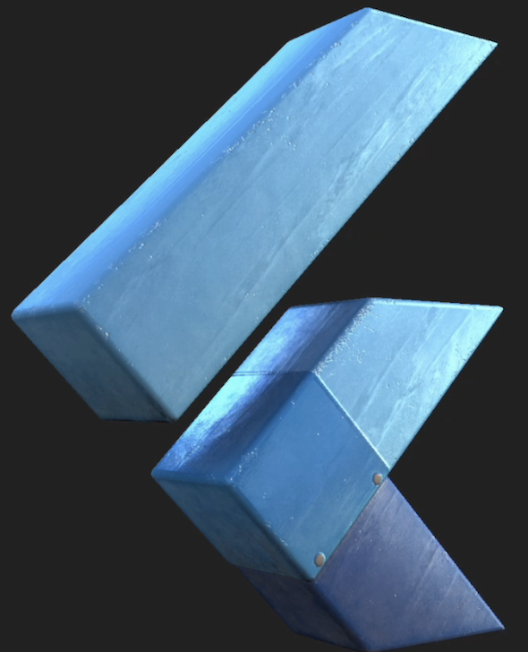

# Flutter Scene

3D library for Flutter.

  

## **Please read:** Makeover in progress!

In 2023, this renderer was shown off at both Flutter Forward and Google I/O (see also the [example repository](https://github.com/bdero/flutter-scene-example)).

Currently, most of the functionality is built in C++ (as a subsystem in Impeller called [Impeller Scene](https://github.com/flutter/flutter/wiki/Impeller-Scene)). In 2023, I took a step back and began building out [Flutter GPU](https://github.com/flutter/flutter/wiki/Flutter-GPU), a new low lever graphics API that talks directly to Impeller's HAL from Dart.

As mentioned in the [Flutter GPU](https://docs.google.com/document/d/1Sh1BAC5c_kkuMVreo7ymBzPoMzb7lamZRPsI7GBXv5M/edit?resourcekey=0-5w8u2V-LS41tCHeoE8bDTQ&tab=t.0#heading=h.z9epe5gif3dw) doc, this renderer is undergoing a rewrite in Flutter GPU. To track progess, please check [this bug](https://github.com/bdero/flutter_scene/issues/1) or the [flutter-gpu branch](https://github.com/bdero/flutter_scene/compare/flutter-gpu) for progress!

## Obligatory warning

⚠️ Experimental: Do not use in production! ⚠️

* This package does not work out of the box and currently requires a special custom build of Flutter Engine.
* This package is in alpha and _will_ break as changes are made to the underlying renderer.
* The underlying Flutter API used to build and render Scene nodes is _not_ supported and _will_ eventually be removed/replaced altogether.

## Features

* Declarative scene widget for building scenes in the Flutter widget tree.
* GLTF asset import.
* Textured materials.
* Blended animation system.

https://github.com/bdero/flutter_scene/assets/919017/b44fba62-ec48-4ab4-80cc-6449cef21292
